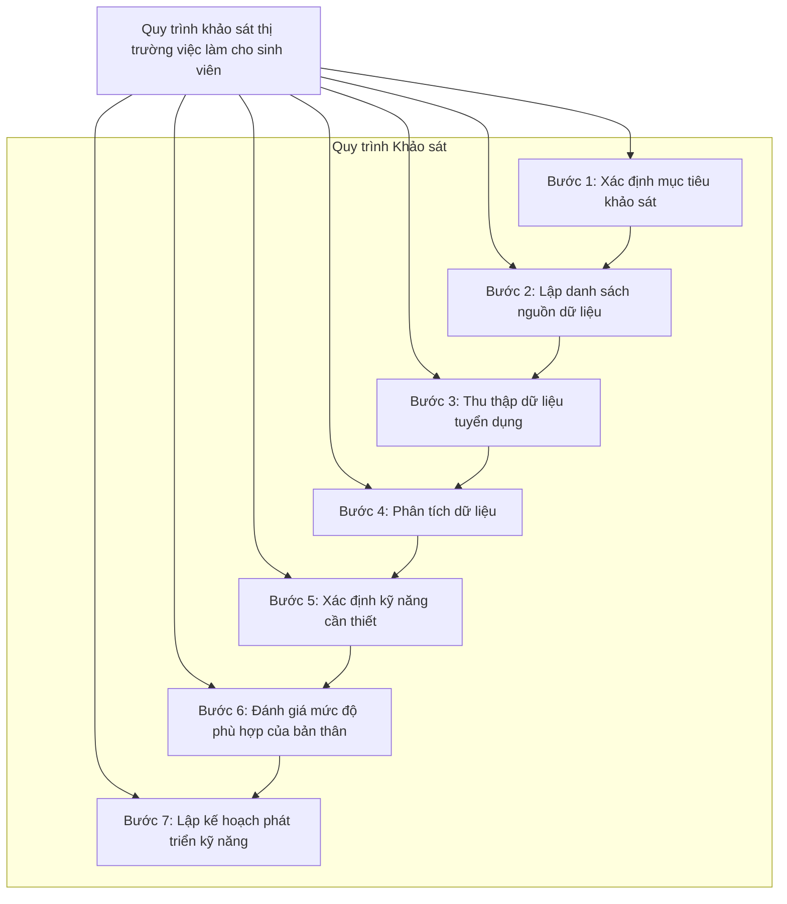

## Vị trí việc làm phổ biến của ngành Thương mại điện tử

### 1. **Chuyên viên Kinh doanh Online (E-commerce Sales Specialist)**
   - Phụ trách tìm kiếm, mở rộng và chăm sóc khách hàng, quản lý đơn hàng trên các sàn TMĐT, phát triển doanh số bán hàng online. 

### 2. **Quản lý Sàn Thương mại Điện tử (E-commerce Platform Manager)**
   - Quản lý các gian hàng trên các nền tảng TMĐT như Shopee, Lazada, Tiki; tối ưu trải nghiệm người dùng và tăng hiệu quả bán hàng. 

### 3. **Chuyên viên Digital Marketing (Digital Marketing Specialist)**
   - Lên kế hoạch, triển khai các chiến dịch quảng cáo, tối ưu hóa nội dung và chiến lược quảng cáo trên các kênh như Google Ads, Facebook, SEO.

### 4. **Chuyên viên Phân tích Dữ liệu (Data Analyst)**
   - Phân tích dữ liệu khách hàng, hành vi mua sắm, xu hướng thị trường để hỗ trợ chiến lược kinh doanh và marketing, giúp tối ưu hóa trải nghiệm khách hàng.

### 5. **Quản lý Sản phẩm (Product Manager)**
   - Quản lý và phát triển sản phẩm từ ý tưởng đến khi ra mắt, phối hợp với các bộ phận khác để đảm bảo sản phẩm đáp ứng nhu cầu thị trường và khách hàng.

### 6. **Chuyên viên Quản lý Chuỗi Cung ứng (Supply Chain Specialist)**
   - Điều phối các hoạt động từ kho vận, giao hàng đến dịch vụ hậu mãi, đảm bảo hàng hóa đến tay khách hàng nhanh chóng và hiệu quả.

### 7. **Chuyên viên Chăm sóc Khách hàng Online (Customer Service Specialist)**
   - Giải đáp các thắc mắc, tư vấn và xử lý khiếu nại của khách hàng qua các kênh online, giúp nâng cao trải nghiệm và sự hài lòng của khách hàng.

### 8. **Chuyên viên Nội dung và SEO (Content & SEO Specialist)**
   - Sản xuất nội dung và tối ưu SEO cho sản phẩm, đảm bảo thông tin sản phẩm hấp dẫn và dễ tìm thấy trên các công cụ tìm kiếm.

### 9. **Quản lý Truyền thông Xã hội (Social Media Manager)**
   - Quản lý, xây dựng và phát triển hình ảnh thương hiệu trên các mạng xã hội, tạo ra các chiến dịch thu hút khách hàng qua các kênh như Facebook, Instagram, TikTok.

### 10. **Chuyên viên UX/UI Design (UX/UI Designer)**
   - Thiết kế giao diện và trải nghiệm người dùng cho các trang TMĐT, giúp tối ưu hóa sự thuận tiện và dễ sử dụng khi khách hàng truy cập và mua hàng.

### 11. **Chuyên viên Phát triển Web TMĐT (E-commerce Web Developer)**
   - Xây dựng và tối ưu các trang web TMĐT, đảm bảo tốc độ tải trang, bảo mật và khả năng mở rộng của hệ thống.

## Quy trình khảo sát thị trường việc làm dành cho sinh viên

## Ví dụ cụ thể cho từng vị trí công việc
### 1. **Chuyên viên Kinh doanh Online (E-commerce Sales Specialist)**
   - Phụ trách tìm kiếm, mở rộng và chăm sóc khách hàng, quản lý đơn hàng trên các sàn TMĐT, phát triển doanh số bán hàng online. 

### 2. **Quản lý Sàn Thương mại Điện tử (E-commerce Platform Manager)**
   - Quản lý các gian hàng trên các nền tảng TMĐT như Shopee, Lazada, Tiki; tối ưu trải nghiệm người dùng và tăng hiệu quả bán hàng. 

### 3. **Chuyên viên Digital Marketing (Digital Marketing Specialist)**
   - Lên kế hoạch, triển khai các chiến dịch quảng cáo, tối ưu hóa nội dung và chiến lược quảng cáo trên các kênh như Google Ads, Facebook, SEO.

### 4. **Chuyên viên Phân tích Dữ liệu (Data Analyst)**
   - Phân tích dữ liệu khách hàng, hành vi mua sắm, xu hướng thị trường để hỗ trợ chiến lược kinh doanh và marketing, giúp tối ưu hóa trải nghiệm khách hàng.

### 5. **Quản lý Sản phẩm (Product Manager)**
   - Quản lý và phát triển sản phẩm từ ý tưởng đến khi ra mắt, phối hợp với các bộ phận khác để đảm bảo sản phẩm đáp ứng nhu cầu thị trường và khách hàng.

### 6. **Chuyên viên Quản lý Chuỗi Cung ứng (Supply Chain Specialist)**
   - Điều phối các hoạt động từ kho vận, giao hàng đến dịch vụ hậu mãi, đảm bảo hàng hóa đến tay khách hàng nhanh chóng và hiệu quả.

### 7. **Chuyên viên Chăm sóc Khách hàng Online (Customer Service Specialist)**
   - Giải đáp các thắc mắc, tư vấn và xử lý khiếu nại của khách hàng qua các kênh online, giúp nâng cao trải nghiệm và sự hài lòng của khách hàng.

### 8. **Chuyên viên Nội dung và SEO (Content & SEO Specialist)**
   - Sản xuất nội dung và tối ưu SEO cho sản phẩm, đảm bảo thông tin sản phẩm hấp dẫn và dễ tìm thấy trên các công cụ tìm kiếm.

### 9. **Quản lý Truyền thông Xã hội (Social Media Manager)**
   - Quản lý, xây dựng và phát triển hình ảnh thương hiệu trên các mạng xã hội, tạo ra các chiến dịch thu hút khách hàng qua các kênh như Facebook, Instagram, TikTok.

### 10. **Chuyên viên UX/UI Design (UX/UI Designer)**
   - Thiết kế giao diện và trải nghiệm người dùng cho các trang TMĐT, giúp tối ưu hóa sự thuận tiện và dễ sử dụng khi khách hàng truy cập và mua hàng.

### 11. **Chuyên viên Phát triển Web TMĐT (E-commerce Web Developer)**
   - Xây dựng và tối ưu các trang web TMĐT, đảm bảo tốc độ tải trang, bảo mật và khả năng mở rộng của hệ thống.
Dưới đây là một quy trình khảo sát thị trường việc làm dành riêng cho vị trí "Chuyên viên Phát triển Web Thương mại điện tử (E-commerce Web Developer)" mà sinh viên có thể thực hiện.

#### 1. **Xác định mục tiêu khảo sát**
   - **Mục tiêu**: Tìm hiểu về yêu cầu công việc, kỹ năng cần thiết, và xu hướng thị trường cho vị trí Chuyên viên Phát triển Web TMĐT.

#### 2. **Lập danh sách nguồn dữ liệu**
   - Nguồn thông tin:
     - Websites tuyển dụng (VietnamWorks, TopCV, JobStreet, LinkedIn)
     - Diễn đàn và cộng đồng lập trình viên (Stack Overflow, GitHub)
     - Phỏng vấn chuyên gia trong ngành (nhà tuyển dụng hoặc người làm việc trong lĩnh vực)
     - Tham gia các hội thảo, webinar về phát triển web và thương mại điện tử

#### 3. **Thu thập dữ liệu tuyển dụng**
   - Sinh viên truy cập các trang web tuyển dụng và ghi chép lại thông tin từ ít nhất 20 tin tuyển dụng cho vị trí Chuyên viên Phát triển Web TMĐT:
     - **Yêu cầu kỹ năng**: 
       - HTML, CSS, JavaScript
       - PHP, Python hoặc Ruby
       - Nền tảng quản lý nội dung (CMS) như WordPress hoặc Magento
       - Kỹ năng thiết kế giao diện người dùng (UI/UX)
     - **Kinh nghiệm**: 
       - Tối thiểu 1-3 năm
       - Kinh nghiệm thực tế với các dự án phát triển web
     - **Mức lương**: 
       - 12-20 triệu VNĐ/tháng tùy thuộc vào kinh nghiệm và kỹ năng

#### 4. **Phân tích dữ liệu**
   - Xác định tần suất xuất hiện của các yêu cầu kỹ năng và công nghệ trong các tin tuyển dụng:
     - HTML/CSS: 15/20 tin
     - JavaScript: 12/20 tin
     - PHP/Python: 10/20 tin
     - Kiến thức về e-commerce: 8/20 tin
   - Phân loại và phân tích các yêu cầu, xác định công nghệ phổ biến trong phát triển web TMĐT.

#### 5. **Xác định kỹ năng cần thiết**
   - Tổng hợp các kỹ năng và kiến thức cần thiết cho vị trí Chuyên viên Phát triển Web TMĐT:
     - Kỹ năng lập trình và phát triển web
     - Kiến thức về hệ thống quản lý nội dung (CMS)
     - Kỹ năng tối ưu hóa hiệu suất website
     - Kỹ năng bảo mật web
     - Kỹ năng giao tiếp và làm việc nhóm

#### 6. **Đánh giá mức độ phù hợp của bản thân**
   - Sinh viên tự đánh giá kỹ năng hiện tại:
     - Kỹ năng lập trình: Đã có nền tảng tốt nhưng cần nâng cao thêm về các framework mới.
     - Kinh nghiệm phát triển web: Đã tham gia một số dự án cá nhân nhưng chưa có kinh nghiệm làm việc thực tế.
     - Kỹ năng UI/UX: Cần cải thiện khả năng thiết kế và hiểu biết về trải nghiệm người dùng.

#### 7. **Lập kế hoạch phát triển kỹ năng**
   - **Kế hoạch**:
     - Tham gia khóa học trực tuyến về phát triển web (Coursera, Udemy) để học thêm về các công nghệ mới.
     - Tìm kiếm thực tập tại các công ty TMĐT hoặc agency phát triển web để tích lũy kinh nghiệm.
     - Tham gia các dự án mã nguồn mở trên GitHub để cải thiện kỹ năng lập trình và làm việc nhóm.
     - Học hỏi từ các chuyên gia qua các diễn đàn và tham gia các sự kiện công nghệ.

### Kết quả
Quy trình khảo sát này giúp sinh viên có cái nhìn rõ ràng về yêu cầu và kỹ năng cần thiết cho vị trí Chuyên viên Phát triển Web TMĐT, từ đó họ có thể lập kế hoạch cụ thể để phát triển bản thân và chuẩn bị cho sự nghiệp tương lai trong lĩnh vực này.
