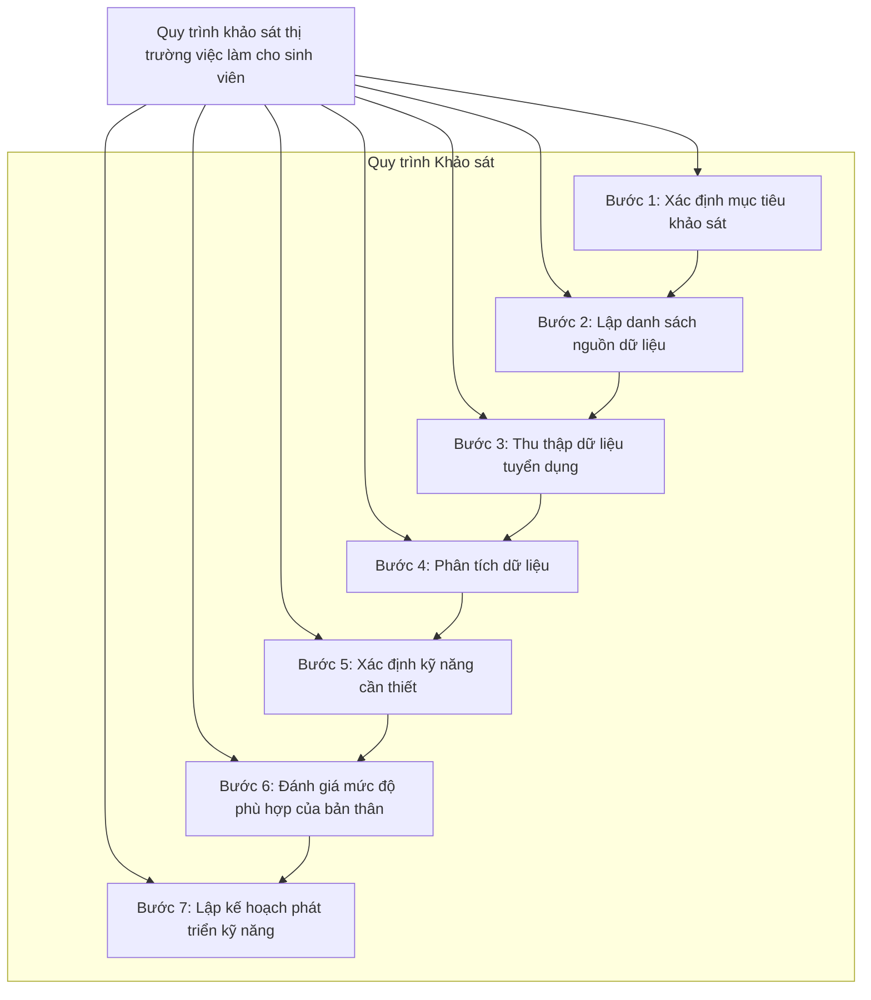

## Vị trí việc làm phổ biến của ngành Thương mại điện tử

### 1. **Chuyên viên Kinh doanh Online (E-commerce Sales Specialist)**
   - Phụ trách tìm kiếm, mở rộng và chăm sóc khách hàng, quản lý đơn hàng trên các sàn TMĐT, phát triển doanh số bán hàng online. 

### 2. **Quản lý Sàn Thương mại Điện tử (E-commerce Platform Manager)**
   - Quản lý các gian hàng trên các nền tảng TMĐT như Shopee, Lazada, Tiki; tối ưu trải nghiệm người dùng và tăng hiệu quả bán hàng. 

### 3. **Chuyên viên Digital Marketing (Digital Marketing Specialist)**
   - Lên kế hoạch, triển khai các chiến dịch quảng cáo, tối ưu hóa nội dung và chiến lược quảng cáo trên các kênh như Google Ads, Facebook, SEO.

### 4. **Chuyên viên Phân tích Dữ liệu (Data Analyst)**
   - Phân tích dữ liệu khách hàng, hành vi mua sắm, xu hướng thị trường để hỗ trợ chiến lược kinh doanh và marketing, giúp tối ưu hóa trải nghiệm khách hàng.

### 5. **Quản lý Sản phẩm (Product Manager)**
   - Quản lý và phát triển sản phẩm từ ý tưởng đến khi ra mắt, phối hợp với các bộ phận khác để đảm bảo sản phẩm đáp ứng nhu cầu thị trường và khách hàng.

### 6. **Chuyên viên Quản lý Chuỗi Cung ứng (Supply Chain Specialist)**
   - Điều phối các hoạt động từ kho vận, giao hàng đến dịch vụ hậu mãi, đảm bảo hàng hóa đến tay khách hàng nhanh chóng và hiệu quả.

### 7. **Chuyên viên Chăm sóc Khách hàng Online (Customer Service Specialist)**
   - Giải đáp các thắc mắc, tư vấn và xử lý khiếu nại của khách hàng qua các kênh online, giúp nâng cao trải nghiệm và sự hài lòng của khách hàng.

### 8. **Chuyên viên Nội dung và SEO (Content & SEO Specialist)**
   - Sản xuất nội dung và tối ưu SEO cho sản phẩm, đảm bảo thông tin sản phẩm hấp dẫn và dễ tìm thấy trên các công cụ tìm kiếm.

### 9. **Quản lý Truyền thông Xã hội (Social Media Manager)**
   - Quản lý, xây dựng và phát triển hình ảnh thương hiệu trên các mạng xã hội, tạo ra các chiến dịch thu hút khách hàng qua các kênh như Facebook, Instagram, TikTok.

### 10. **Chuyên viên UX/UI Design (UX/UI Designer)**
   - Thiết kế giao diện và trải nghiệm người dùng cho các trang TMĐT, giúp tối ưu hóa sự thuận tiện và dễ sử dụng khi khách hàng truy cập và mua hàng.

### 11. **Chuyên viên Phát triển Web TMĐT (E-commerce Web Developer)**
   - Xây dựng và tối ưu các trang web TMĐT, đảm bảo tốc độ tải trang, bảo mật và khả năng mở rộng của hệ thống.

## Quy trình khảo sát thị trường việc làm dành cho sinh viên

## Ví dụ cụ thể cho từng vị trí công việc
## 1. **Chuyên viên Kinh doanh Online (E-commerce Sales Specialist)**
   - Phụ trách tìm kiếm, mở rộng và chăm sóc khách hàng, quản lý đơn hàng trên các sàn TMĐT, phát triển doanh số bán hàng online. 
Dưới đây là một quy trình khảo sát thị trường việc làm dành riêng cho vị trí "Chuyên viên Kinh doanh Online (E-commerce Sales Specialist)" mà sinh viên có thể thực hiện.

#### 1. **Xác định mục tiêu khảo sát**
   - **Mục tiêu**: Tìm hiểu về yêu cầu công việc, kỹ năng cần thiết và xu hướng thị trường cho vị trí Chuyên viên Kinh doanh Online.

#### 2. **Lập danh sách nguồn dữ liệu**
   - Nguồn thông tin:
     - Websites tuyển dụng (VietnamWorks, TopCV, JobStreet, LinkedIn)
     - Diễn đàn và cộng đồng kinh doanh online (Facebook Groups, các diễn đàn thương mại điện tử)
     - Phỏng vấn chuyên gia trong ngành (nhà tuyển dụng hoặc chuyên gia trong lĩnh vực thương mại điện tử)
     - Tham gia các hội thảo, webinar về kinh doanh online và thương mại điện tử

#### 3. **Thu thập dữ liệu tuyển dụng**
   - Sinh viên truy cập các trang web tuyển dụng và ghi chép lại thông tin từ ít nhất 20 tin tuyển dụng cho vị trí Chuyên viên Kinh doanh Online:
     - **Yêu cầu kỹ năng**:
       - Kỹ năng tiếp thị số (digital marketing), bao gồm SEO, SEM, và quảng cáo trên mạng xã hội
       - Kỹ năng giao tiếp và thương lượng
       - Kiến thức về quản lý khách hàng (CRM)
       - Kỹ năng phân tích dữ liệu để theo dõi và tối ưu hóa doanh thu
     - **Kinh nghiệm**:
       - Tối thiểu 1-3 năm (tùy vào vị trí)
       - Kinh nghiệm trong môi trường thương mại điện tử hoặc bán hàng trực tuyến
     - **Mức lương**:
       - 10-20 triệu VNĐ/tháng tùy thuộc vào kinh nghiệm và kỹ năng

#### 4. **Phân tích dữ liệu**
   - Xác định tần suất xuất hiện của các yêu cầu kỹ năng trong các tin tuyển dụng:
     - Kỹ năng tiếp thị số: 15/20 tin
     - Kỹ năng giao tiếp: 12/20 tin
     - Kỹ năng phân tích dữ liệu: 10/20 tin
     - Kiến thức về CRM: 8/20 tin
   - Phân loại và phân tích các yêu cầu, xác định xu hướng hiện tại trong lĩnh vực kinh doanh online.

#### 5. **Xác định kỹ năng cần thiết**
   - Tổng hợp các kỹ năng và kiến thức cần thiết cho vị trí Chuyên viên Kinh doanh Online:
     - Kỹ năng tiếp thị số
     - Kỹ năng giao tiếp và thuyết phục
     - Kỹ năng phân tích dữ liệu
     - Kiến thức về các nền tảng thương mại điện tử (như Shopify, WooCommerce)
     - Kỹ năng chăm sóc khách hàng và quản lý mối quan hệ

#### 6. **Đánh giá mức độ phù hợp của bản thân**
   - Sinh viên tự đánh giá kỹ năng hiện tại:
     - Kỹ năng tiếp thị số: Có nền tảng nhưng cần học thêm về quảng cáo trên mạng xã hội.
     - Kinh nghiệm bán hàng: Đã tham gia một số dự án nhỏ nhưng chưa có kinh nghiệm làm việc thực tế.
     - Kỹ năng phân tích dữ liệu: Đã học lý thuyết nhưng chưa có cơ hội thực hành.

#### 7. **Lập kế hoạch phát triển kỹ năng**
   - **Kế hoạch**:
     - Tham gia khóa học trực tuyến về tiếp thị số và thương mại điện tử (Coursera, Udemy) để nâng cao kỹ năng.
     - Tìm kiếm cơ hội thực tập tại các công ty thương mại điện tử hoặc doanh nghiệp có hoạt động kinh doanh online để tích lũy kinh nghiệm thực tế.
     - Tham gia các hội thảo về tiếp thị số và kinh doanh online để mở rộng kiến thức và mạng lưới.
     - Thực hiện các dự án cá nhân liên quan đến kinh doanh online để rèn luyện kỹ năng và xây dựng portfolio.

### Kết quả
Quy trình khảo sát này giúp sinh viên có cái nhìn rõ ràng về yêu cầu và kỹ năng cần thiết cho vị trí Chuyên viên Kinh doanh Online, từ đó họ có thể lập kế hoạch cụ thể để phát triển bản thân và chuẩn bị cho sự nghiệp tương lai trong lĩnh vực này.

## 2. **Quản lý Sàn Thương mại Điện tử (E-commerce Platform Manager)**
   - Quản lý các gian hàng trên các nền tảng TMĐT như Shopee, Lazada, Tiki; tối ưu trải nghiệm người dùng và tăng hiệu quả bán hàng. 
Dưới đây là một quy trình khảo sát thị trường việc làm dành riêng cho vị trí "Quản lý Sàn Thương mại Điện tử (E-commerce Platform Manager)" mà sinh viên có thể thực hiện.

#### 1. **Xác định mục tiêu khảo sát**
   - **Mục tiêu**: Tìm hiểu về yêu cầu công việc, kỹ năng cần thiết và xu hướng thị trường cho vị trí Quản lý Sàn Thương mại Điện tử.

#### 2. **Lập danh sách nguồn dữ liệu**
   - Nguồn thông tin:
     - Websites tuyển dụng (VietnamWorks, TopCV, JobStreet, LinkedIn)
     - Diễn đàn và cộng đồng thương mại điện tử (Facebook Groups, các diễn đàn chuyên ngành)
     - Phỏng vấn chuyên gia trong ngành (nhà tuyển dụng, nhà quản lý sàn thương mại điện tử)
     - Tham gia các hội thảo, webinar về quản lý sàn thương mại điện tử và kinh doanh online

#### 3. **Thu thập dữ liệu tuyển dụng**
   - Sinh viên truy cập các trang web tuyển dụng và ghi chép lại thông tin từ ít nhất 20 tin tuyển dụng cho vị trí Quản lý Sàn Thương mại Điện tử:
     - **Yêu cầu kỹ năng**:
       - Kỹ năng quản lý dự án
       - Kinh nghiệm về tiếp thị và bán hàng trực tuyến
       - Kiến thức về phân tích dữ liệu và tối ưu hóa hiệu suất
       - Kỹ năng giao tiếp và quản lý mối quan hệ
     - **Kinh nghiệm**:
       - Tối thiểu 3-5 năm (tùy vào vị trí)
       - Kinh nghiệm trong quản lý sàn thương mại điện tử hoặc môi trường tương tự
     - **Mức lương**:
       - 20-40 triệu VNĐ/tháng tùy thuộc vào kinh nghiệm và quy mô doanh nghiệp

#### 4. **Phân tích dữ liệu**
   - Xác định tần suất xuất hiện của các yêu cầu kỹ năng trong các tin tuyển dụng:
     - Kỹ năng quản lý dự án: 14/20 tin
     - Kinh nghiệm tiếp thị và bán hàng: 12/20 tin
     - Kỹ năng phân tích dữ liệu: 11/20 tin
     - Kỹ năng giao tiếp: 10/20 tin
   - Phân loại và phân tích các yêu cầu, xác định xu hướng hiện tại trong quản lý sàn thương mại điện tử.

#### 5. **Xác định kỹ năng cần thiết**
   - Tổng hợp các kỹ năng và kiến thức cần thiết cho vị trí Quản lý Sàn Thương mại Điện tử:
     - Kỹ năng quản lý dự án và lập kế hoạch
     - Kỹ năng phân tích dữ liệu và sử dụng các công cụ phân tích (Google Analytics, báo cáo bán hàng)
     - Kiến thức về chiến lược tiếp thị số
     - Kỹ năng giao tiếp và quản lý mối quan hệ với người bán hàng và khách hàng
     - Kỹ năng giải quyết vấn đề và ra quyết định

#### 6. **Đánh giá mức độ phù hợp của bản thân**
   - Sinh viên tự đánh giá kỹ năng hiện tại:
     - Kỹ năng quản lý dự án: Đã học lý thuyết nhưng chưa có kinh nghiệm thực tế.
     - Kinh nghiệm tiếp thị: Có kiến thức nhưng cần thực hành để hiểu rõ hơn về chiến lược tiếp thị.
     - Kỹ năng phân tích: Cần cải thiện kỹ năng sử dụng các công cụ phân tích dữ liệu.

#### 7. **Lập kế hoạch phát triển kỹ năng**
   - **Kế hoạch**:
     - Tham gia khóa học trực tuyến về quản lý dự án và thương mại điện tử (Coursera, Udemy) để nâng cao kỹ năng.
     - Tìm kiếm cơ hội thực tập tại các công ty quản lý sàn thương mại điện tử để tích lũy kinh nghiệm thực tế.
     - Tham gia các hội thảo về quản lý sàn và tiếp thị số để mở rộng kiến thức và mạng lưới.
     - Thực hiện các dự án cá nhân hoặc tham gia vào các dự án nhóm để phát triển kỹ năng quản lý và phân tích dữ liệu.

### Kết quả
Quy trình khảo sát này giúp sinh viên có cái nhìn rõ ràng về yêu cầu và kỹ năng cần thiết cho vị trí Quản lý Sàn Thương mại Điện tử, từ đó họ có thể lập kế hoạch cụ thể để phát triển bản thân và chuẩn bị cho sự nghiệp tương lai trong lĩnh vực này.

## 3. **Chuyên viên Digital Marketing (Digital Marketing Specialist)**
   - Lên kế hoạch, triển khai các chiến dịch quảng cáo, tối ưu hóa nội dung và chiến lược quảng cáo trên các kênh như Google Ads, Facebook, SEO.
Dưới đây là một quy trình khảo sát thị trường việc làm dành riêng cho vị trí "Chuyên viên Digital Marketing (Digital Marketing Specialist)" mà sinh viên có thể thực hiện.

### Quy trình khảo sát thị trường việc làm: Chuyên viên Digital Marketing

#### 1. **Xác định mục tiêu khảo sát**
   - **Mục tiêu**: Tìm hiểu về yêu cầu công việc, kỹ năng cần thiết và xu hướng thị trường cho vị trí Chuyên viên Digital Marketing.

#### 2. **Lập danh sách nguồn dữ liệu**
   - Nguồn thông tin:
     - Websites tuyển dụng (VietnamWorks, TopCV, JobStreet, LinkedIn)
     - Diễn đàn và cộng đồng marketing (Facebook Groups, diễn đàn chuyên ngành)
     - Phỏng vấn chuyên gia trong ngành (nhà tuyển dụng, các chuyên gia marketing)
     - Tham gia các hội thảo, webinar về Digital Marketing

#### 3. **Thu thập dữ liệu tuyển dụng**
   - Sinh viên truy cập các trang web tuyển dụng và ghi chép lại thông tin từ ít nhất 20 tin tuyển dụng cho vị trí Chuyên viên Digital Marketing:
     - **Yêu cầu kỹ năng**:
       - Kỹ năng SEO và SEM
       - Kỹ năng quản lý quảng cáo trên các nền tảng mạng xã hội (Facebook, Instagram, Google Ads)
       - Kỹ năng phân tích dữ liệu và sử dụng các công cụ phân tích (Google Analytics, Facebook Insights)
       - Kỹ năng sáng tạo nội dung và viết bài
     - **Kinh nghiệm**:
       - Tối thiểu 1-3 năm (tùy vào vị trí)
       - Kinh nghiệm trong lĩnh vực marketing số hoặc thương mại điện tử
     - **Mức lương**:
       - 10-25 triệu VNĐ/tháng tùy thuộc vào kinh nghiệm và kỹ năng

#### 4. **Phân tích dữ liệu**
   - Xác định tần suất xuất hiện của các yêu cầu kỹ năng trong các tin tuyển dụng:
     - Kỹ năng SEO: 15/20 tin
     - Kỹ năng quản lý quảng cáo: 13/20 tin
     - Kỹ năng phân tích dữ liệu: 12/20 tin
     - Kỹ năng viết nội dung: 11/20 tin
   - Phân loại và phân tích các yêu cầu, xác định xu hướng hiện tại trong lĩnh vực Digital Marketing.

#### 5. **Xác định kỹ năng cần thiết**
   - Tổng hợp các kỹ năng và kiến thức cần thiết cho vị trí Chuyên viên Digital Marketing:
     - Kỹ năng SEO và SEM
     - Kỹ năng phân tích và sử dụng dữ liệu
     - Kỹ năng sáng tạo nội dung
     - Kỹ năng giao tiếp và làm việc nhóm
     - Kiến thức về các công cụ marketing automation

#### 6. **Đánh giá mức độ phù hợp của bản thân**
   - Sinh viên tự đánh giá kỹ năng hiện tại:
     - Kỹ năng SEO: Đã học lý thuyết nhưng cần thực hành để hiểu rõ hơn.
     - Kinh nghiệm quảng cáo trực tuyến: Chưa có kinh nghiệm thực tế.
     - Kỹ năng phân tích: Có kiến thức cơ bản nhưng chưa quen với các công cụ phân tích.

#### 7. **Lập kế hoạch phát triển kỹ năng**
   - **Kế hoạch**:
     - Tham gia khóa học trực tuyến về Digital Marketing (Coursera, Udemy) để nâng cao kỹ năng SEO và quảng cáo trực tuyến.
     - Tìm kiếm cơ hội thực tập tại các công ty marketing hoặc doanh nghiệp có hoạt động Digital Marketing để tích lũy kinh nghiệm thực tế.
     - Tham gia các hội thảo về Digital Marketing để mở rộng kiến thức và mạng lưới.
     - Thực hiện các dự án cá nhân liên quan đến marketing số để rèn luyện kỹ năng và xây dựng portfolio.

### Kết quả
Quy trình khảo sát này giúp sinh viên có cái nhìn rõ ràng về yêu cầu và kỹ năng cần thiết cho vị trí Chuyên viên Digital Marketing, từ đó họ có thể lập kế hoạch cụ thể để phát triển bản thân và chuẩn bị cho sự nghiệp tương lai trong lĩnh vực này.

## 4. **Chuyên viên Phân tích Dữ liệu (Data Analyst)**
   - Phân tích dữ liệu khách hàng, hành vi mua sắm, xu hướng thị trường để hỗ trợ chiến lược kinh doanh và marketing, giúp tối ưu hóa trải nghiệm khách hàng.

Dưới đây là một quy trình khảo sát thị trường việc làm dành riêng cho vị trí "Chuyên viên Phân tích Dữ liệu (Data Analyst)" mà sinh viên có thể thực hiện.

### Quy trình khảo sát thị trường việc làm: Chuyên viên Phân tích Dữ liệu

#### 1. **Xác định mục tiêu khảo sát**
   - **Mục tiêu**: Tìm hiểu về yêu cầu công việc, kỹ năng cần thiết và xu hướng thị trường cho vị trí Chuyên viên Phân tích Dữ liệu.

#### 2. **Lập danh sách nguồn dữ liệu**
   - Nguồn thông tin:
     - Websites tuyển dụng (VietnamWorks, TopCV, JobStreet, LinkedIn)
     - Diễn đàn và cộng đồng phân tích dữ liệu (Facebook Groups, các diễn đàn chuyên ngành)
     - Phỏng vấn chuyên gia trong ngành (nhà tuyển dụng, các chuyên gia phân tích dữ liệu)
     - Tham gia các hội thảo, webinar về phân tích dữ liệu và khoa học dữ liệu

#### 3. **Thu thập dữ liệu tuyển dụng**
   - Sinh viên truy cập các trang web tuyển dụng và ghi chép lại thông tin từ ít nhất 20 tin tuyển dụng cho vị trí Chuyên viên Phân tích Dữ liệu:
     - **Yêu cầu kỹ năng**:
       - Kỹ năng phân tích số liệu và báo cáo
       - Kiến thức về các công cụ phân tích dữ liệu (Excel, SQL, Python, R)
       - Kỹ năng trực quan hóa dữ liệu (sử dụng Tableau, Power BI)
       - Kỹ năng tư duy phản biện và giải quyết vấn đề
     - **Kinh nghiệm**:
       - Tối thiểu 1-3 năm (tùy vào vị trí)
       - Kinh nghiệm trong phân tích dữ liệu, thống kê hoặc lĩnh vực liên quan
     - **Mức lương**:
       - 12-30 triệu VNĐ/tháng tùy thuộc vào kinh nghiệm và kỹ năng

#### 4. **Phân tích dữ liệu**
   - Xác định tần suất xuất hiện của các yêu cầu kỹ năng trong các tin tuyển dụng:
     - Kỹ năng phân tích số liệu: 16/20 tin
     - Kiến thức công cụ phân tích: 14/20 tin
     - Kỹ năng trực quan hóa dữ liệu: 12/20 tin
     - Kỹ năng tư duy phản biện: 10/20 tin
   - Phân loại và phân tích các yêu cầu, xác định xu hướng hiện tại trong lĩnh vực phân tích dữ liệu.

#### 5. **Xác định kỹ năng cần thiết**
   - Tổng hợp các kỹ năng và kiến thức cần thiết cho vị trí Chuyên viên Phân tích Dữ liệu:
     - Kỹ năng phân tích và báo cáo số liệu
     - Kiến thức về các công cụ phân tích (Excel, SQL, Python, R)
     - Kỹ năng trực quan hóa dữ liệu
     - Kỹ năng tư duy phản biện và giải quyết vấn đề
     - Kỹ năng giao tiếp để trình bày kết quả phân tích

#### 6. **Đánh giá mức độ phù hợp của bản thân**
   - Sinh viên tự đánh giá kỹ năng hiện tại:
     - Kỹ năng phân tích số liệu: Đã có nền tảng nhưng cần thực hành nhiều hơn.
     - Kiến thức công cụ phân tích: Chưa có kinh nghiệm thực tế với SQL hoặc Python.
     - Kỹ năng trực quan hóa dữ liệu: Chưa quen với các công cụ như Tableau hoặc Power BI.

#### 7. **Lập kế hoạch phát triển kỹ năng**
   - **Kế hoạch**:
     - Tham gia khóa học trực tuyến về phân tích dữ liệu và trực quan hóa dữ liệu (Coursera, Udemy) để nâng cao kỹ năng.
     - Tìm kiếm cơ hội thực tập tại các công ty phân tích dữ liệu hoặc doanh nghiệp có nhu cầu cao về phân tích dữ liệu.
     - Tham gia các hội thảo về khoa học dữ liệu và phân tích dữ liệu để mở rộng kiến thức và mạng lưới.
     - Thực hiện các dự án cá nhân liên quan đến phân tích dữ liệu để rèn luyện kỹ năng và xây dựng portfolio.

### Kết quả
Quy trình khảo sát này giúp sinh viên có cái nhìn rõ ràng về yêu cầu và kỹ năng cần thiết cho vị trí Chuyên viên Phân tích Dữ liệu, từ đó họ có thể lập kế hoạch cụ thể để phát triển bản thân và chuẩn bị cho sự nghiệp tương lai trong lĩnh vực này.

## 5. **Quản lý Sản phẩm (Product Manager)**
   - Quản lý và phát triển sản phẩm từ ý tưởng đến khi ra mắt, phối hợp với các bộ phận khác để đảm bảo sản phẩm đáp ứng nhu cầu thị trường và khách hàng.

Dưới đây là quy trình khảo sát thị trường việc làm dành riêng cho vị trí "Quản lý Sản phẩm (Product Manager)" mà sinh viên có thể thực hiện.

### Quy trình khảo sát thị trường việc làm: Quản lý Sản phẩm

#### 1. **Xác định mục tiêu khảo sát**
   - **Mục tiêu**: Tìm hiểu về yêu cầu công việc, kỹ năng cần thiết và xu hướng thị trường cho vị trí Quản lý Sản phẩm.

#### 2. **Lập danh sách nguồn dữ liệu**
   - Nguồn thông tin:
     - Websites tuyển dụng (VietnamWorks, TopCV, JobStreet, LinkedIn)
     - Diễn đàn và cộng đồng quản lý sản phẩm (Facebook Groups, diễn đàn chuyên ngành)
     - Phỏng vấn chuyên gia trong ngành (nhà tuyển dụng, các quản lý sản phẩm kỳ cựu)
     - Tham gia các hội thảo, webinar về quản lý sản phẩm và phát triển sản phẩm

#### 3. **Thu thập dữ liệu tuyển dụng**
   - Sinh viên truy cập các trang web tuyển dụng và ghi chép lại thông tin từ ít nhất 20 tin tuyển dụng cho vị trí Quản lý Sản phẩm:
     - **Yêu cầu kỹ năng**:
       - Kỹ năng phân tích thị trường và đối thủ cạnh tranh
       - Kỹ năng lập kế hoạch và phát triển sản phẩm
       - Kỹ năng giao tiếp và phối hợp làm việc nhóm
       - Kiến thức về UX/UI và trải nghiệm người dùng
       - Kỹ năng quản lý dự án và thời gian
     - **Kinh nghiệm**:
       - Tối thiểu 2-5 năm (tùy vào vị trí)
       - Kinh nghiệm trong phát triển sản phẩm, quản lý dự án hoặc lĩnh vực liên quan
     - **Mức lương**:
       - 20-50 triệu VNĐ/tháng tùy thuộc vào kinh nghiệm và quy mô doanh nghiệp

#### 4. **Phân tích dữ liệu**
   - Xác định tần suất xuất hiện của các yêu cầu kỹ năng trong các tin tuyển dụng:
     - Kỹ năng phân tích thị trường: 15/20 tin
     - Kỹ năng phát triển sản phẩm: 14/20 tin
     - Kỹ năng giao tiếp: 13/20 tin
     - Kiến thức về UX/UI: 12/20 tin
     - Kỹ năng quản lý dự án: 11/20 tin
   - Phân loại và phân tích các yêu cầu, xác định xu hướng hiện tại trong lĩnh vực quản lý sản phẩm.

#### 5. **Xác định kỹ năng cần thiết**
   - Tổng hợp các kỹ năng và kiến thức cần thiết cho vị trí Quản lý Sản phẩm:
     - Kỹ năng phân tích và nghiên cứu thị trường
     - Kỹ năng lập kế hoạch và phát triển sản phẩm
     - Kiến thức về UX/UI và trải nghiệm người dùng
     - Kỹ năng giao tiếp và làm việc nhóm
     - Kỹ năng quản lý dự án và thời gian

#### 6. **Đánh giá mức độ phù hợp của bản thân**
   - Sinh viên tự đánh giá kỹ năng hiện tại:
     - Kỹ năng phân tích thị trường: Có kiến thức nhưng cần rèn luyện thêm.
     - Kỹ năng lập kế hoạch sản phẩm: Chưa có kinh nghiệm thực tế.
     - Kiến thức về UX/UI: Đã học nhưng cần hiểu rõ hơn về cách áp dụng trong phát triển sản phẩm.

#### 7. **Lập kế hoạch phát triển kỹ năng**
   - **Kế hoạch**:
     - Tham gia khóa học trực tuyến về quản lý sản phẩm (Coursera, Udemy) để nâng cao kỹ năng.
     - Tìm kiếm cơ hội thực tập tại các công ty phát triển sản phẩm hoặc các startup để tích lũy kinh nghiệm thực tế.
     - Tham gia các hội thảo về quản lý sản phẩm để mở rộng kiến thức và mạng lưới.
     - Thực hiện các dự án cá nhân hoặc tham gia vào các dự án nhóm để phát triển kỹ năng quản lý và lập kế hoạch.

### Kết quả
Quy trình khảo sát này giúp sinh viên có cái nhìn rõ ràng về yêu cầu và kỹ năng cần thiết cho vị trí Quản lý Sản phẩm, từ đó họ có thể lập kế hoạch cụ thể để phát triển bản thân và chuẩn bị cho sự nghiệp tương lai trong lĩnh vực này.

## 6. **Chuyên viên Quản lý Chuỗi Cung ứng (Supply Chain Specialist)**
   - Điều phối các hoạt động từ kho vận, giao hàng đến dịch vụ hậu mãi, đảm bảo hàng hóa đến tay khách hàng nhanh chóng và hiệu quả.
Dưới đây là quy trình khảo sát thị trường việc làm dành riêng cho vị trí "Chuyên viên Quản lý Chuỗi Cung ứng (Supply Chain Specialist)" mà sinh viên có thể thực hiện.

### Quy trình khảo sát thị trường việc làm: Chuyên viên Quản lý Chuỗi Cung ứng

#### 1. **Xác định mục tiêu khảo sát**
   - **Mục tiêu**: Tìm hiểu về yêu cầu công việc, kỹ năng cần thiết và xu hướng thị trường cho vị trí Chuyên viên Quản lý Chuỗi Cung ứng.

#### 2. **Lập danh sách nguồn dữ liệu**
   - Nguồn thông tin:
     - Websites tuyển dụng (VietnamWorks, TopCV, JobStreet, LinkedIn)
     - Diễn đàn và cộng đồng chuỗi cung ứng (Facebook Groups, diễn đàn chuyên ngành)
     - Phỏng vấn chuyên gia trong ngành (nhà tuyển dụng, các chuyên gia quản lý chuỗi cung ứng)
     - Tham gia các hội thảo, webinar về chuỗi cung ứng và logistics

#### 3. **Thu thập dữ liệu tuyển dụng**
   - Sinh viên truy cập các trang web tuyển dụng và ghi chép lại thông tin từ ít nhất 20 tin tuyển dụng cho vị trí Chuyên viên Quản lý Chuỗi Cung ứng:
     - **Yêu cầu kỹ năng**:
       - Kiến thức về quy trình chuỗi cung ứng và logistics
       - Kỹ năng phân tích dữ liệu và quản lý tồn kho
       - Kỹ năng giao tiếp và phối hợp làm việc nhóm
       - Kỹ năng đàm phán và quản lý nhà cung cấp
       - Kiến thức về các phần mềm quản lý chuỗi cung ứng (SAP, Oracle, hoặc các hệ thống tương tự)
     - **Kinh nghiệm**:
       - Tối thiểu 1-3 năm (tùy vào vị trí)
       - Kinh nghiệm trong quản lý chuỗi cung ứng, logistics hoặc lĩnh vực liên quan
     - **Mức lương**:
       - 12-30 triệu VNĐ/tháng tùy thuộc vào kinh nghiệm và quy mô doanh nghiệp

#### 4. **Phân tích dữ liệu**
   - Xác định tần suất xuất hiện của các yêu cầu kỹ năng trong các tin tuyển dụng:
     - Kiến thức chuỗi cung ứng: 16/20 tin
     - Kỹ năng phân tích dữ liệu: 14/20 tin
     - Kỹ năng giao tiếp: 13/20 tin
     - Kỹ năng đàm phán: 12/20 tin
     - Kiến thức phần mềm quản lý: 10/20 tin
   - Phân loại và phân tích các yêu cầu, xác định xu hướng hiện tại trong lĩnh vực quản lý chuỗi cung ứng.

#### 5. **Xác định kỹ năng cần thiết**
   - Tổng hợp các kỹ năng và kiến thức cần thiết cho vị trí Chuyên viên Quản lý Chuỗi Cung ứng:
     - Kiến thức về quy trình chuỗi cung ứng và logistics
     - Kỹ năng phân tích và quản lý dữ liệu
     - Kỹ năng giao tiếp và làm việc nhóm
     - Kỹ năng đàm phán và quản lý nhà cung cấp
     - Kiến thức về phần mềm quản lý chuỗi cung ứng

#### 6. **Đánh giá mức độ phù hợp của bản thân**
   - Sinh viên tự đánh giá kỹ năng hiện tại:
     - Kiến thức chuỗi cung ứng: Đã có nền tảng nhưng cần rèn luyện thêm.
     - Kỹ năng phân tích dữ liệu: Chưa có kinh nghiệm thực tế.
     - Kỹ năng giao tiếp: Cần cải thiện và phát triển thêm.

#### 7. **Lập kế hoạch phát triển kỹ năng**
   - **Kế hoạch**:
     - Tham gia khóa học trực tuyến về quản lý chuỗi cung ứng (Coursera, Udemy) để nâng cao kỹ năng.
     - Tìm kiếm cơ hội thực tập tại các công ty logistics hoặc doanh nghiệp có hoạt động chuỗi cung ứng để tích lũy kinh nghiệm thực tế.
     - Tham gia các hội thảo về chuỗi cung ứng để mở rộng kiến thức và mạng lưới.
     - Thực hiện các dự án cá nhân liên quan đến quản lý chuỗi cung ứng để rèn luyện kỹ năng và xây dựng portfolio.

### Kết quả
Quy trình khảo sát này giúp sinh viên có cái nhìn rõ ràng về yêu cầu và kỹ năng cần thiết cho vị trí Chuyên viên Quản lý Chuỗi Cung ứng, từ đó họ có thể lập kế hoạch cụ thể để phát triển bản thân và chuẩn bị cho sự nghiệp tương lai trong lĩnh vực này.

## 7. **Chuyên viên Chăm sóc Khách hàng Online (Customer Service Specialist)**
   - Giải đáp các thắc mắc, tư vấn và xử lý khiếu nại của khách hàng qua các kênh online, giúp nâng cao trải nghiệm và sự hài lòng của khách hàng.

Dưới đây là quy trình khảo sát thị trường việc làm dành riêng cho vị trí "Chuyên viên Chăm sóc Khách hàng Online (Customer Service Specialist)" mà sinh viên có thể thực hiện.

### Quy trình khảo sát thị trường việc làm: Chuyên viên Chăm sóc Khách hàng Online

#### 1. **Xác định mục tiêu khảo sát**
   - **Mục tiêu**: Tìm hiểu về yêu cầu công việc, kỹ năng cần thiết và xu hướng thị trường cho vị trí Chuyên viên Chăm sóc Khách hàng Online.

#### 2. **Lập danh sách nguồn dữ liệu**
   - Nguồn thông tin:
     - Websites tuyển dụng (VietnamWorks, TopCV, JobStreet, LinkedIn)
     - Diễn đàn và cộng đồng chăm sóc khách hàng (Facebook Groups, diễn đàn chuyên ngành)
     - Phỏng vấn chuyên gia trong ngành (nhà tuyển dụng, các chuyên viên chăm sóc khách hàng)
     - Tham gia các hội thảo, webinar về chăm sóc khách hàng

#### 3. **Thu thập dữ liệu tuyển dụng**
   - Sinh viên truy cập các trang web tuyển dụng và ghi chép lại thông tin từ ít nhất 20 tin tuyển dụng cho vị trí Chuyên viên Chăm sóc Khách hàng Online:
     - **Yêu cầu kỹ năng**:
       - Kỹ năng giao tiếp tốt qua điện thoại và các nền tảng trực tuyến
       - Kỹ năng xử lý vấn đề và giải quyết khiếu nại của khách hàng
       - Kiến thức về sản phẩm và dịch vụ của công ty
       - Kỹ năng quản lý thời gian và sắp xếp công việc
       - Sử dụng thành thạo các phần mềm hỗ trợ chăm sóc khách hàng (CRM, hệ thống ticketing)
     - **Kinh nghiệm**:
       - Tối thiểu 1-2 năm (tùy vào vị trí)
       - Kinh nghiệm trong lĩnh vực chăm sóc khách hàng hoặc hỗ trợ kỹ thuật
     - **Mức lương**:
       - 8-20 triệu VNĐ/tháng tùy thuộc vào kinh nghiệm và quy mô doanh nghiệp

#### 4. **Phân tích dữ liệu**
   - Xác định tần suất xuất hiện của các yêu cầu kỹ năng trong các tin tuyển dụng:
     - Kỹ năng giao tiếp: 17/20 tin
     - Kỹ năng xử lý vấn đề: 15/20 tin
     - Kiến thức sản phẩm: 14/20 tin
     - Kỹ năng quản lý thời gian: 12/20 tin
     - Sử dụng phần mềm CRM: 10/20 tin
   - Phân loại và phân tích các yêu cầu, xác định xu hướng hiện tại trong lĩnh vực chăm sóc khách hàng.

#### 5. **Xác định kỹ năng cần thiết**
   - Tổng hợp các kỹ năng và kiến thức cần thiết cho vị trí Chuyên viên Chăm sóc Khách hàng Online:
     - Kỹ năng giao tiếp hiệu quả
     - Kỹ năng xử lý vấn đề và khiếu nại
     - Kiến thức về sản phẩm và dịch vụ
     - Kỹ năng quản lý thời gian
     - Sử dụng phần mềm hỗ trợ chăm sóc khách hàng

#### 6. **Đánh giá mức độ phù hợp của bản thân**
   - Sinh viên tự đánh giá kỹ năng hiện tại:
     - Kỹ năng giao tiếp: Có khả năng nhưng cần luyện tập thêm.
     - Kỹ năng xử lý vấn đề: Đã có kinh nghiệm nhưng cần cải thiện.
     - Kiến thức sản phẩm: Cần tìm hiểu thêm về sản phẩm dịch vụ của công ty.

#### 7. **Lập kế hoạch phát triển kỹ năng**
   - **Kế hoạch**:
     - Tham gia khóa học trực tuyến về kỹ năng chăm sóc khách hàng (Coursera, Udemy) để nâng cao kỹ năng.
     - Tìm kiếm cơ hội thực tập tại các công ty có bộ phận chăm sóc khách hàng để tích lũy kinh nghiệm thực tế.
     - Tham gia các hội thảo về chăm sóc khách hàng để mở rộng kiến thức và mạng lưới.
     - Thực hành giao tiếp qua các nền tảng trực tuyến để nâng cao kỹ năng.

### Kết quả
Quy trình khảo sát này giúp sinh viên có cái nhìn rõ ràng về yêu cầu và kỹ năng cần thiết cho vị trí Chuyên viên Chăm sóc Khách hàng Online, từ đó họ có thể lập kế hoạch cụ thể để phát triển bản thân và chuẩn bị cho sự nghiệp tương lai trong lĩnh vực này.

## 8. **Chuyên viên Nội dung và SEO (Content & SEO Specialist)**
   - Sản xuất nội dung và tối ưu SEO cho sản phẩm, đảm bảo thông tin sản phẩm hấp dẫn và dễ tìm thấy trên các công cụ tìm kiếm.

Dưới đây là quy trình khảo sát thị trường việc làm dành riêng cho vị trí "Chuyên viên Nội dung và SEO (Content & SEO Specialist)" mà sinh viên có thể thực hiện.

### Quy trình khảo sát thị trường việc làm: Chuyên viên Nội dung và SEO

#### 1. **Xác định mục tiêu khảo sát**
   - **Mục tiêu**: Tìm hiểu về yêu cầu công việc, kỹ năng cần thiết và xu hướng thị trường cho vị trí Chuyên viên Nội dung và SEO.

#### 2. **Lập danh sách nguồn dữ liệu**
   - Nguồn thông tin:
     - Websites tuyển dụng (VietnamWorks, TopCV, JobStreet, LinkedIn)
     - Diễn đàn và cộng đồng SEO (Facebook Groups, diễn đàn chuyên ngành)
     - Phỏng vấn chuyên gia trong ngành (nhà tuyển dụng, các chuyên viên SEO)
     - Tham gia các hội thảo, webinar về SEO và nội dung số

#### 3. **Thu thập dữ liệu tuyển dụng**
   - Sinh viên truy cập các trang web tuyển dụng và ghi chép lại thông tin từ ít nhất 20 tin tuyển dụng cho vị trí Chuyên viên Nội dung và SEO:
     - **Yêu cầu kỹ năng**:
       - Kỹ năng viết nội dung sáng tạo và chất lượng
       - Kiến thức về SEO (tối ưu hóa công cụ tìm kiếm) và cách thức hoạt động của các thuật toán tìm kiếm
       - Kỹ năng phân tích dữ liệu và sử dụng các công cụ SEO (Google Analytics, Ahrefs, SEMrush)
       - Kỹ năng quản lý thời gian và lập kế hoạch nội dung
       - Kiến thức về marketing số và các kênh truyền thông xã hội
     - **Kinh nghiệm**:
       - Tối thiểu 1-3 năm (tùy vào vị trí)
       - Kinh nghiệm trong lĩnh vực nội dung số, marketing hoặc SEO
     - **Mức lương**:
       - 10-25 triệu VNĐ/tháng tùy thuộc vào kinh nghiệm và quy mô doanh nghiệp

#### 4. **Phân tích dữ liệu**
   - Xác định tần suất xuất hiện của các yêu cầu kỹ năng trong các tin tuyển dụng:
     - Kỹ năng viết nội dung: 18/20 tin
     - Kiến thức về SEO: 16/20 tin
     - Kỹ năng phân tích dữ liệu: 14/20 tin
     - Kỹ năng quản lý thời gian: 12/20 tin
     - Kiến thức về marketing số: 10/20 tin
   - Phân loại và phân tích các yêu cầu, xác định xu hướng hiện tại trong lĩnh vực nội dung và SEO.

#### 5. **Xác định kỹ năng cần thiết**
   - Tổng hợp các kỹ năng và kiến thức cần thiết cho vị trí Chuyên viên Nội dung và SEO:
     - Kỹ năng viết nội dung sáng tạo và chất lượng
     - Kiến thức về SEO và thuật toán tìm kiếm
     - Kỹ năng phân tích dữ liệu
     - Kỹ năng quản lý thời gian
     - Kiến thức về marketing số và truyền thông xã hội

#### 6. **Đánh giá mức độ phù hợp của bản thân**
   - Sinh viên tự đánh giá kỹ năng hiện tại:
     - Kỹ năng viết: Có khả năng viết tốt nhưng cần cải thiện về phong cách và chất lượng.
     - Kiến thức về SEO: Cần học thêm về các công cụ SEO và kỹ thuật tối ưu hóa.
     - Kỹ năng phân tích dữ liệu: Chưa có nhiều kinh nghiệm trong phân tích dữ liệu SEO.

#### 7. **Lập kế hoạch phát triển kỹ năng**
   - **Kế hoạch**:
     - Tham gia khóa học trực tuyến về viết nội dung và SEO (Coursera, Udemy) để nâng cao kỹ năng.
     - Tìm kiếm cơ hội thực tập tại các công ty có bộ phận marketing hoặc nội dung để tích lũy kinh nghiệm thực tế.
     - Tham gia các hội thảo về SEO và marketing số để mở rộng kiến thức và mạng lưới.
     - Thực hành viết nội dung cho blog cá nhân hoặc trang mạng xã hội để nâng cao kỹ năng viết.

### Kết quả
Quy trình khảo sát này giúp sinh viên có cái nhìn rõ ràng về yêu cầu và kỹ năng cần thiết cho vị trí Chuyên viên Nội dung và SEO, từ đó họ có thể lập kế hoạch cụ thể để phát triển bản thân và chuẩn bị cho sự nghiệp tương lai trong lĩnh vực này.

## 9. **Quản lý Truyền thông Xã hội (Social Media Manager)**
   - Quản lý, xây dựng và phát triển hình ảnh thương hiệu trên các mạng xã hội, tạo ra các chiến dịch thu hút khách hàng qua các kênh như Facebook, Instagram, TikTok.

Dưới đây là quy trình khảo sát thị trường việc làm dành riêng cho vị trí "Quản lý Truyền thông Xã hội (Social Media Manager)" mà sinh viên có thể thực hiện.

### Quy trình khảo sát thị trường việc làm: Quản lý Truyền thông Xã hội

#### 1. **Xác định mục tiêu khảo sát**
   - **Mục tiêu**: Tìm hiểu về yêu cầu công việc, kỹ năng cần thiết và xu hướng thị trường cho vị trí Quản lý Truyền thông Xã hội.

#### 2. **Lập danh sách nguồn dữ liệu**
   - Nguồn thông tin:
     - Websites tuyển dụng (VietnamWorks, TopCV, JobStreet, LinkedIn)
     - Diễn đàn và cộng đồng marketing số (Facebook Groups, diễn đàn chuyên ngành)
     - Phỏng vấn chuyên gia trong ngành (nhà tuyển dụng, các chuyên viên truyền thông xã hội)
     - Tham gia các hội thảo, webinar về truyền thông xã hội

#### 3. **Thu thập dữ liệu tuyển dụng**
   - Sinh viên truy cập các trang web tuyển dụng và ghi chép lại thông tin từ ít nhất 20 tin tuyển dụng cho vị trí Quản lý Truyền thông Xã hội:
     - **Yêu cầu kỹ năng**:
       - Kỹ năng lập kế hoạch và quản lý nội dung truyền thông xã hội
       - Kỹ năng giao tiếp tốt, bao gồm viết và nói
       - Kiến thức về các nền tảng truyền thông xã hội (Facebook, Instagram, LinkedIn, Twitter, TikTok, v.v.)
       - Kỹ năng phân tích dữ liệu và sử dụng các công cụ phân tích (Google Analytics, Hootsuite, Buffer)
       - Kỹ năng xử lý khủng hoảng và phản hồi khách hàng
     - **Kinh nghiệm**:
       - Tối thiểu 1-3 năm (tùy vào vị trí)
       - Kinh nghiệm trong lĩnh vực truyền thông xã hội hoặc marketing
     - **Mức lương**:
       - 10-25 triệu VNĐ/tháng tùy thuộc vào kinh nghiệm và quy mô doanh nghiệp

#### 4. **Phân tích dữ liệu**
   - Xác định tần suất xuất hiện của các yêu cầu kỹ năng trong các tin tuyển dụng:
     - Kỹ năng lập kế hoạch nội dung: 17/20 tin
     - Kỹ năng giao tiếp: 16/20 tin
     - Kiến thức về nền tảng truyền thông xã hội: 15/20 tin
     - Kỹ năng phân tích dữ liệu: 14/20 tin
     - Kỹ năng xử lý khủng hoảng: 12/20 tin
   - Phân loại và phân tích các yêu cầu, xác định xu hướng hiện tại trong lĩnh vực truyền thông xã hội.

#### 5. **Xác định kỹ năng cần thiết**
   - Tổng hợp các kỹ năng và kiến thức cần thiết cho vị trí Quản lý Truyền thông Xã hội:
     - Kỹ năng lập kế hoạch và quản lý nội dung
     - Kỹ năng giao tiếp tốt
     - Kiến thức về các nền tảng truyền thông xã hội
     - Kỹ năng phân tích dữ liệu
     - Kỹ năng xử lý khủng hoảng và phản hồi khách hàng

#### 6. **Đánh giá mức độ phù hợp của bản thân**
   - Sinh viên tự đánh giá kỹ năng hiện tại:
     - Kỹ năng lập kế hoạch: Có khả năng nhưng cần cải thiện trong việc lập kế hoạch dài hạn.
     - Kỹ năng giao tiếp: Tốt, nhưng cần rèn luyện thêm để viết nội dung thu hút hơn.
     - Kiến thức về nền tảng truyền thông xã hội: Cần tìm hiểu thêm về các công cụ phân tích và chiến lược.

#### 7. **Lập kế hoạch phát triển kỹ năng**
   - **Kế hoạch**:
     - Tham gia khóa học trực tuyến về quản lý truyền thông xã hội (Coursera, Udemy) để nâng cao kỹ năng.
     - Tìm kiếm cơ hội thực tập tại các công ty có bộ phận truyền thông xã hội để tích lũy kinh nghiệm thực tế.
     - Tham gia các hội thảo về truyền thông xã hội và marketing để mở rộng kiến thức và mạng lưới.
     - Thực hành viết nội dung cho các trang mạng xã hội cá nhân hoặc tham gia vào các dự án cộng đồng để nâng cao kỹ năng.

### Kết quả
Quy trình khảo sát này giúp sinh viên có cái nhìn rõ ràng về yêu cầu và kỹ năng cần thiết cho vị trí Quản lý Truyền thông Xã hội, từ đó họ có thể lập kế hoạch cụ thể để phát triển bản thân và chuẩn bị cho sự nghiệp tương lai trong lĩnh vực này.

## 10. **Chuyên viên UX/UI Design (UX/UI Designer)**
   - Thiết kế giao diện và trải nghiệm người dùng cho các trang TMĐT, giúp tối ưu hóa sự thuận tiện và dễ sử dụng khi khách hàng truy cập và mua hàng.
Dưới đây là một quy trình khảo sát thị trường việc làm dành riêng cho vị trí "Chuyên viên UX/UI Design" mà sinh viên có thể thực hiện.

#### 1. **Xác định mục tiêu khảo sát**
   - **Mục tiêu**: Tìm hiểu về yêu cầu công việc, kỹ năng cần thiết và xu hướng thị trường cho vị trí Chuyên viên UX/UI Design.

#### 2. **Lập danh sách nguồn dữ liệu**
   - Nguồn thông tin:
     - Websites tuyển dụng (VietnamWorks, TopCV, JobStreet, LinkedIn)
     - Diễn đàn và cộng đồng thiết kế (Designer Hangout, UX Design Community)
     - Phỏng vấn chuyên gia trong ngành (nhà tuyển dụng, nhà thiết kế có kinh nghiệm)
     - Tham gia các hội thảo, webinar về UX/UI và thiết kế sản phẩm

#### 3. **Thu thập dữ liệu tuyển dụng**
   - Sinh viên truy cập các trang web tuyển dụng và ghi chép lại thông tin từ ít nhất 20 tin tuyển dụng cho vị trí Chuyên viên UX/UI Design:
     - **Yêu cầu kỹ năng**: 
       - Thiết kế giao diện người dùng (UI)
       - Nghiên cứu người dùng và trải nghiệm người dùng (UX)
       - Sử dụng các công cụ thiết kế (Sketch, Figma, Adobe XD)
       - Kỹ năng tạo prototype và wireframe
     - **Kinh nghiệm**: 
       - Tối thiểu 1-3 năm (tùy vào vị trí)
       - Kinh nghiệm với các dự án thiết kế thực tế
     - **Mức lương**: 
       - 12-25 triệu VNĐ/tháng tùy thuộc vào kinh nghiệm và kỹ năng

#### 4. **Phân tích dữ liệu**
   - Xác định tần suất xuất hiện của các yêu cầu kỹ năng trong các tin tuyển dụng:
     - Thiết kế UI: 16/20 tin
     - Nghiên cứu UX: 14/20 tin
     - Sử dụng công cụ thiết kế: 13/20 tin
     - Kỹ năng giao tiếp: 10/20 tin
   - Phân loại và phân tích các yêu cầu, xác định xu hướng thiết kế hiện tại trong UX/UI.

#### 5. **Xác định kỹ năng cần thiết**
   - Tổng hợp các kỹ năng và kiến thức cần thiết cho vị trí Chuyên viên UX/UI Design:
     - Kỹ năng thiết kế đồ họa và bố cục
     - Kỹ năng nghiên cứu người dùng và phân tích dữ liệu
     - Kỹ năng giao tiếp và làm việc nhóm
     - Kiến thức về nguyên tắc thiết kế và trải nghiệm người dùng
     - Kỹ năng tạo prototype và wireframe

#### 6. **Đánh giá mức độ phù hợp của bản thân**
   - Sinh viên tự đánh giá kỹ năng hiện tại:
     - Kỹ năng thiết kế: Có khả năng sử dụng các công cụ thiết kế cơ bản nhưng cần nâng cao kỹ năng tạo prototype.
     - Kinh nghiệm nghiên cứu người dùng: Chưa có kinh nghiệm thực tế trong việc thu thập và phân tích phản hồi từ người dùng.
     - Kỹ năng giao tiếp: Khá tốt nhưng cần cải thiện kỹ năng thuyết trình ý tưởng thiết kế.

#### 7. **Lập kế hoạch phát triển kỹ năng**
   - **Kế hoạch**:
     - Tham gia khóa học trực tuyến về UX/UI Design (Coursera, Udemy) để học thêm về nghiên cứu người dùng và thiết kế trải nghiệm.
     - Tìm kiếm thực tập tại các công ty thiết kế hoặc công ty công nghệ để tích lũy kinh nghiệm thực tế.
     - Tham gia các hội thảo về UX/UI để học hỏi từ các chuyên gia trong ngành và mở rộng mối quan hệ.
     - Thực hiện các dự án cá nhân để rèn luyện kỹ năng thiết kế và tạo portfolio cá nhân.

### Kết quả
Quy trình khảo sát này giúp sinh viên có cái nhìn rõ ràng về yêu cầu và kỹ năng cần thiết cho vị trí Chuyên viên UX/UI Design, từ đó họ có thể lập kế hoạch cụ thể để phát triển bản thân và chuẩn bị cho sự nghiệp tương lai trong lĩnh vực này.

## 11. **Chuyên viên Phát triển Web TMĐT (E-commerce Web Developer)**
   - Xây dựng và tối ưu các trang web TMĐT, đảm bảo tốc độ tải trang, bảo mật và khả năng mở rộng của hệ thống.
Dưới đây là một quy trình khảo sát thị trường việc làm dành riêng cho vị trí "Chuyên viên Phát triển Web Thương mại điện tử (E-commerce Web Developer)" mà sinh viên có thể thực hiện.

#### 1. **Xác định mục tiêu khảo sát**
   - **Mục tiêu**: Tìm hiểu về yêu cầu công việc, kỹ năng cần thiết, và xu hướng thị trường cho vị trí Chuyên viên Phát triển Web TMĐT.

#### 2. **Lập danh sách nguồn dữ liệu**
   - Nguồn thông tin:
     - Websites tuyển dụng (VietnamWorks, TopCV, JobStreet, LinkedIn)
     - Diễn đàn và cộng đồng lập trình viên (Stack Overflow, GitHub)
     - Phỏng vấn chuyên gia trong ngành (nhà tuyển dụng hoặc người làm việc trong lĩnh vực)
     - Tham gia các hội thảo, webinar về phát triển web và thương mại điện tử

#### 3. **Thu thập dữ liệu tuyển dụng**
   - Sinh viên truy cập các trang web tuyển dụng và ghi chép lại thông tin từ ít nhất 20 tin tuyển dụng cho vị trí Chuyên viên Phát triển Web TMĐT:
     - **Yêu cầu kỹ năng**: 
       - HTML, CSS, JavaScript
       - PHP, Python hoặc Ruby
       - Nền tảng quản lý nội dung (CMS) như WordPress hoặc Magento
       - Kỹ năng thiết kế giao diện người dùng (UI/UX)
     - **Kinh nghiệm**: 
       - Tối thiểu 1-3 năm
       - Kinh nghiệm thực tế với các dự án phát triển web
     - **Mức lương**: 
       - 12-20 triệu VNĐ/tháng tùy thuộc vào kinh nghiệm và kỹ năng

#### 4. **Phân tích dữ liệu**
   - Xác định tần suất xuất hiện của các yêu cầu kỹ năng và công nghệ trong các tin tuyển dụng:
     - HTML/CSS: 15/20 tin
     - JavaScript: 12/20 tin
     - PHP/Python: 10/20 tin
     - Kiến thức về e-commerce: 8/20 tin
   - Phân loại và phân tích các yêu cầu, xác định công nghệ phổ biến trong phát triển web TMĐT.

#### 5. **Xác định kỹ năng cần thiết**
   - Tổng hợp các kỹ năng và kiến thức cần thiết cho vị trí Chuyên viên Phát triển Web TMĐT:
     - Kỹ năng lập trình và phát triển web
     - Kiến thức về hệ thống quản lý nội dung (CMS)
     - Kỹ năng tối ưu hóa hiệu suất website
     - Kỹ năng bảo mật web
     - Kỹ năng giao tiếp và làm việc nhóm

#### 6. **Đánh giá mức độ phù hợp của bản thân**
   - Sinh viên tự đánh giá kỹ năng hiện tại:
     - Kỹ năng lập trình: Đã có nền tảng tốt nhưng cần nâng cao thêm về các framework mới.
     - Kinh nghiệm phát triển web: Đã tham gia một số dự án cá nhân nhưng chưa có kinh nghiệm làm việc thực tế.
     - Kỹ năng UI/UX: Cần cải thiện khả năng thiết kế và hiểu biết về trải nghiệm người dùng.

#### 7. **Lập kế hoạch phát triển kỹ năng**
   - **Kế hoạch**:
     - Tham gia khóa học trực tuyến về phát triển web (Coursera, Udemy) để học thêm về các công nghệ mới.
     - Tìm kiếm thực tập tại các công ty TMĐT hoặc agency phát triển web để tích lũy kinh nghiệm.
     - Tham gia các dự án mã nguồn mở trên GitHub để cải thiện kỹ năng lập trình và làm việc nhóm.
     - Học hỏi từ các chuyên gia qua các diễn đàn và tham gia các sự kiện công nghệ.

### Kết quả
Quy trình khảo sát này giúp sinh viên có cái nhìn rõ ràng về yêu cầu và kỹ năng cần thiết cho vị trí Chuyên viên Phát triển Web TMĐT, từ đó họ có thể lập kế hoạch cụ thể để phát triển bản thân và chuẩn bị cho sự nghiệp tương lai trong lĩnh vực này.
